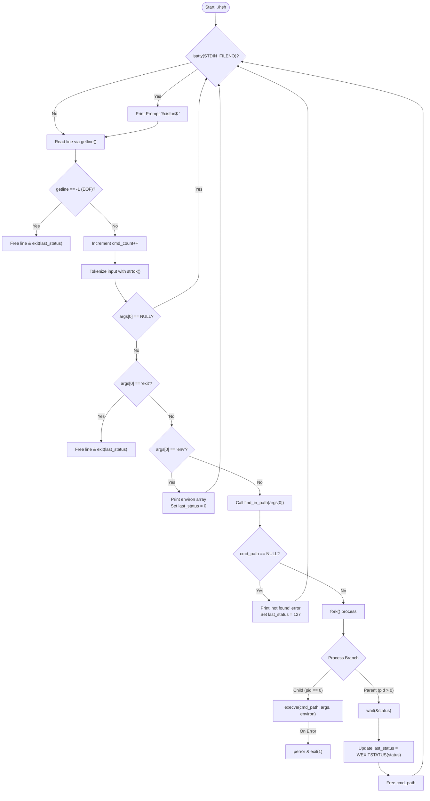

# Holberton School Simple Shell

Welcome to the Holberton School Simple Shell project! This is a simple shell, developed by Nycole Medina and Kevin Rodríguez. It is designed to handle command lines with arguments, manage the PATH, and include built-in functionalities.

## Table of Contents

- [Introduction](#introduction)
- [Project Files](#project-files)
- [Features](#features)
- [Usage](#usage)
- [Authors](#authors)
- [Repository](#repository)

## Introduction 💭

This simple shell is a project developed for Holberton School. It includes the following features:

- Handling command lines with arguments
- Managing the PATH
- Not calling fork if the command doesn't exist
- Implementing the `exit` built-in to exit the shell
- Implementing the `env` built-in to print the current environment

## Project Files 📑

The project consists of the following files:

- `AUTHORS`
- `README.md` (You're here!)
- `man_1_simple_shell`
- `main.c`
- `main.h`
- `_getenv.c`
- `handlepath.c`

## Features 🔨

### Handling Command Lines

The shell handles command lines with arguments, ensuring execution of commands.

### PATH Management

The PATH is managed to locate executable files and execute commands.

### Non-fork Execution

The fork is not called if the command doesn't exist, optimizing the execution process.

### Exit Built-in

The shell includes the `exit` built-in, allowing users to exit the shell easily.

**Usage:**
```bash
$ exit
```

### Env Built-in

The `env` built-in is implemented to print the current environment.


## Flowchart 📌


## Usage 💻

To use the simple shell, follow these steps:

1. Clone the repository:
   ```bash
   git clone https://github.com/nycolemedina-lab/holbertonschool-simple_shell.git
   ```

2. Compile the shell:
   ```bash
   gcc -Wall -Werror -Wextra -pedantic *.c -o hsh
   ```

3. Run the shell:
   ```bash
   ./hsh
   ```

4. Enjoy using the simple shell!

## Bugs 📢
No known bugs.

## Authors ✒️

- [Nycole Medina](https://github.com/nycolemedina-lab)
- [Kevin Rodríguez](https://github.com/ender325)

## Repository 📔

[Holberton School Simple Shell Repository](https://github.com/nycolemedina-lab/holbertonschool-simple_shell)